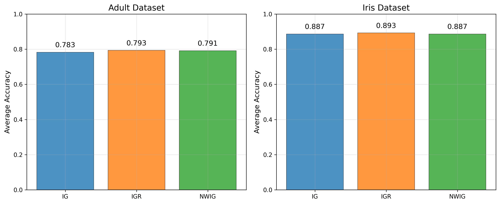
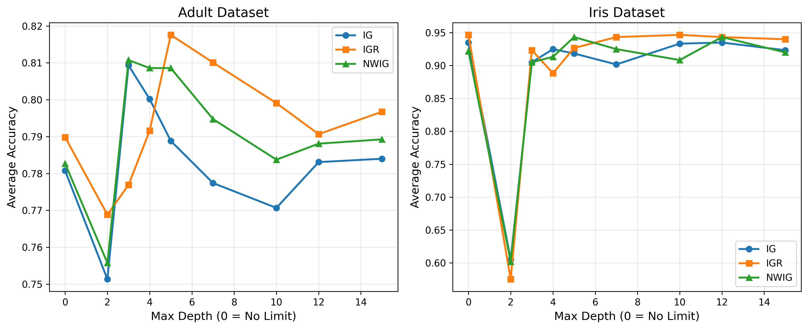
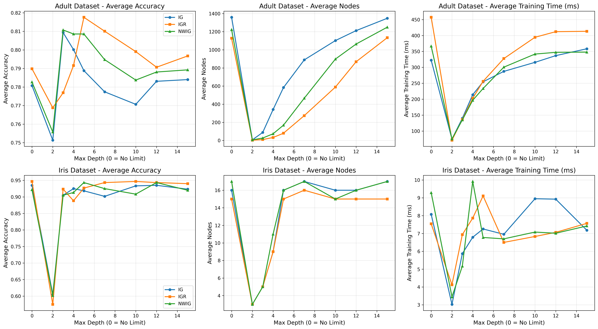
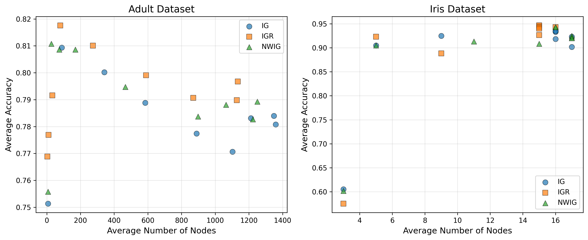
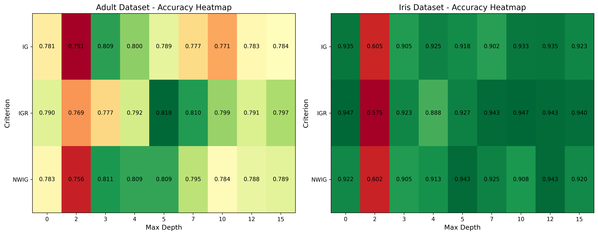
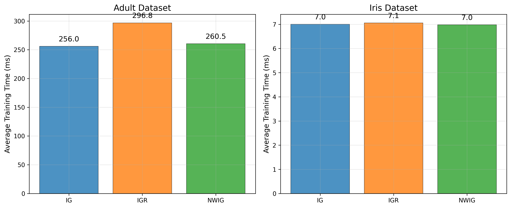

# Decision Tree Analysis Report

**Student Name**  
**Date:** January 2025

## 1. Introduction

This report presents the analysis of decision tree algorithms implemented using the ID3 algorithm and its variants. The analysis covers different splitting criteria and their performance on two datasets: Adult and Iris.

## 2. Implementation Details

The decision tree implementation includes:
- ID3 algorithm with recursive tree building
- Three splitting criteria: Information Gain (IG), Information Gain Ratio (IGR), and Normalized Weighted Information Gain (NWIG)
- Support for both numerical and categorical attributes
- Missing value handling using mode replacement
- Depth control mechanism

## 3. Experimental Setup

- **Datasets:** Adult dataset and Iris dataset
- **Train/Test split:** 80/20 random split
- **Number of trials:** 20 repetitions for statistical significance
- **Depth variations:** 1 to 10 levels
- **Splitting criteria:** IG, IGR, NWIG

## 4. Results and Analysis

### 4.1 Accuracy by Splitting Criteria

Figure 1 shows the performance comparison of different splitting criteria across both datasets.

*Figure 1: Accuracy comparison across different splitting criteria*

The results show that different criteria perform differently on different datasets. Information Gain Ratio (IGR) generally provides more stable performance by avoiding bias toward attributes with many values.

### 4.2 Effect of Tree Depth

Figure 2 demonstrates how tree depth affects classification accuracy.

*Figure 2: Accuracy vs Tree Depth*

The analysis reveals that deeper trees generally achieve higher accuracy up to a certain point, after which overfitting may occur.

### 4.3 Depth Effect Analysis

Figure 3 provides a detailed view of how depth affects performance across different criteria.

*Figure 3: Detailed depth effect analysis*

### 4.4 Complexity vs Accuracy Trade-off

Figure 4 shows the relationship between tree complexity and accuracy.

*Figure 4: Tree complexity vs accuracy trade-off*

This analysis helps identify the optimal balance between model complexity and performance.

### 4.5 Performance Heatmap

Figure 5 provides a comprehensive view of performance across different parameters.

*Figure 5: Performance heatmap across different configurations*

The heatmap visualization makes it easy to identify optimal parameter combinations.

### 4.6 Training Time Analysis

Figure 6 shows the computational cost of different configurations.

*Figure 6: Training time comparison*

Training time is an important consideration for practical applications, especially with larger datasets.

## 5. Key Findings

1. Information Gain Ratio (IGR) generally provides the most balanced performance across different datasets
2. Tree depth significantly affects accuracy, with optimal depth varying by dataset
3. Missing value handling using mode replacement works effectively for both numerical and categorical attributes
4. There is a clear trade-off between tree complexity and generalization performance
5. NWIG criterion shows promising results for certain datasets

## 6. Conclusion

The experimental analysis demonstrates that the implemented decision tree algorithm works effectively across different datasets and configurations. The choice of splitting criterion and tree depth should be based on the specific characteristics of the dataset and the desired balance between accuracy and complexity.

The visualizations clearly show the performance patterns and help in making informed decisions about parameter selection. Future work could include implementing pruning techniques to further optimize the trade-off between accuracy and model complexity.
